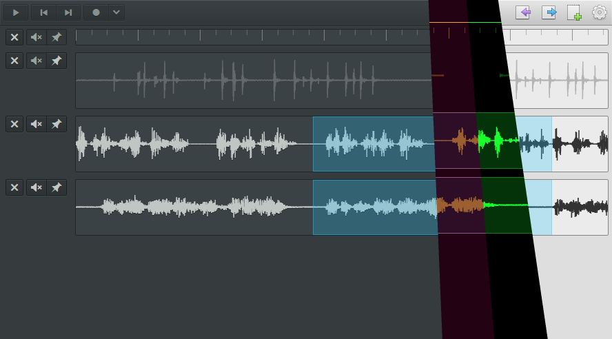

# [][app]

[Wavey][app] is a simple web-based digital audio workstation (DAW), **currently in pre-alpha**.

[][app]

### Features

* Drag and drop audio files or record from a microphone.*⁂
* Always saved locally, including persistent undo/redo with the selection state; saves *while* you're recording⁂
* Plays while recording so you can record along with previous tracks⁂
* Lets you edit while playing or recording; you can even delete the recording while recording and undo to keep recording
* Several themes, including light and dark [elementary OS][] themes via [elementary.css][], and some retro themes
* Fully scalable graphics, from the icons to the waveforms
* Export the document or a selected range as WAV or MP3
* Can work completely offline, with [sw-precache][]

\*Audio recording quality may or may not match native applications in a given browser.
Record redundantly with another application if it matters to you.

⁂There's a bug right now where **chunks are lost when recording!**
Dropped chunks will become skips (as opposed to gaps, which would be more visible).
When this happens, the data written to the timeline starts to fall further and further behind the position indicator.
If you try to record something in time with something already recorded,
the skips will cause it to be shifted earlier in time and get out of sync.
(In addition to just messing up your recording itself.)

### Future Features

* Note how the bar with beat markings is a track. It would become a metronome when unmuted.
It's a simplification of the concepts over DAWs which traditionally have a separate metronome.
There will still need to be a way to specify the BPM, and
it would also be good to have BPM detection and
variable BPM support (hopefully tying into a general automation system).
By the way, what if you could keep the beat with a foot pedal (or other input),
and record that along with whatever track or tracks you're recording?
That could be an alternative to beat detection, which might require less manual refinement.

* Tracks can be pinned to the top,
which should ease the pain when you have many tracks with audio clips
you want to line up with some main audio track(s).
(This partially implemented, but currently pinned tracks don't actually stay at the top when scrolling down.)

* You will be able to "precord" up to five minutes as long as precording has been enabled.
Choose whether to record something after the fact,
with the caveat(s) that you have to have this feature enabled and your mic(s) set up beforehand.
(Sadly it's not *actually* time travel.)
	* [Precorder][] is a separate project to do a similar thing
	on a device like a Raspberry Pi,
	the idea being you could have it always running,
	minimizing setup time and effort for recording.

* Projects should be able to contain separate, distinct timelines;
some DAWs have "takes", maybe something like that is what I want.
Ableton Live does something fairly reasonable from what I remember.
(Although it was difficult to get it to actually record anything.)

* Nonlinear undo history.
If you hit undo a bunch, then do something, normally the data is instantly lost.
If you try to redo, it doesn't do anything.
Instead, it should pop up with a tree view of the history.

* Soloing tracks? I wonder if something better could be done in this area.
Some more general system for configuring the set of tracks to play?
I don't know, but it's something to think about.

* MIDI: I'm thinking of having a collapsed overview of a MIDI clip,
and an expanded view to edit the notes, but still inline in the track.
(I've made a basic collapsed notes view component but haven't made a way to actually create it in the editor,
i.e. no way to record/import/create MIDI data.)

* Effects!
Adding gain and panning would be easy,
but I don't want to immitate the status quo UI
and end up with something that's "good enough" but not as good as it could be.
I think if the effects UI is good enough, they should be able to be treated the same as any other effects.
Gain and panning may warrant special treatment
such as being added by default to the effects chain (or graph?),
but they probably shouldn't be separate from it.
You'll at least want to be able to automate them just the same.

* Plugins
	* Instrument interfaces like
	[tri-chromatic-keyboard](https://github.com/1j01/tri-chromatic-keyboard) or
	[guitar](https://github.com/1j01/guitar),
	or even [Pink Trombone](https://dood.al/pinktrombone/),
	a human vocal simulator which would be awesome to have, and which could benefit from some "MIDI programming" / control assignment
	at least when multitouch is unavailable, i.e. on desktop (maybe it could be made to work as a remote control on a phone?),
	and if it could be automated you could more easily produce speech and such
	and then you could like fade from saying something into gibberish, or do all kinds of stuff
	* Synthesizers (voices) that play sound from note data
	* Effects (there are lots of effects libraries already available, waiting to be hooked up to some UI)
	* Algorithmic synthesis like [HTML5 Bytebeat](http://greggman.com/downloads/examples/html5bytebeat/html5bytebeat.html),
	possibly optionally crossed with [Shadershop](https://github.com/cdglabs/Shadershop)
	* Extra file formats (for exporting and importing audio and project files)
	* Themes
	<!-- (note that custom themes could essentially make the entire UI an implicit API) -->
	<!-- (some of the worst APIs come from not realizing you're making an API)-->

* Desktop app

* Interoperability with other audio editors? (project file import/export)

* Whatever replaces Web Intents, probably the [Web Share API](https://github.com/WICG/web-share) and [Web Share Target API](https://github.com/WICG/web-share-target)

### The Less Exciting To-Do List

* Set up [JSX with CoffeeScript 2](http://coffeescript.org/v2/#jsx)
(which needs a separate compilation step to actually interpret the JSX that it outputs)
in place of my [ReactScript][] DSL (which I should also deprecate)
* Document loading indicator
* Fix losing chunks when recording
* Decouple the rendering rate of recorded audio from the size of chunks saved
(maybe even have a tiered saving system where chunks are merged to improve load times)
* Fix pasting across non-consecutive tracks
(or just pasting in general? <kbd>^A^X^V</kbd> doesn't work at all when there's one track;
and it appears to clear the cursor, but pasting still doesn't work (at that point it should create a new track))
* Maybe make the mute buttons clearer by making the iconography *not negative*;
(would it be awkward to still call them mute buttons or have the hover text say mute/unmute?)
* Mouse-relative zooming (preferably performant and smoothly animated; currently zooming is slow)
* Lossless compression for audio storage (currently it's stored uncompressed)
* Storage management (handle running out of storage, handle multiple editors loaded for the same document, allow data purging, estimate max recording time)
* Improve accessibility
* Internationalization

### Contributing

Contributions and criticism welcome.
[Open up an issue][new issue] to discuss features, problems, or improvements!
Or [email me](mailto:isaiahodhner@gmail.com) if you prefer.

This project is built with [CoffeeScript][], [React][], and (currently) [ReactScript][].

(I plan on ditching ReactScript, and I'm also open to switching the source to ES6+ or TypeScript)

The main app code is in the root component, `src/components/AudioEditor.coffee`.
(`src/app.coffee`'s main job is just to render `AudioEditor` to the DOM.)

#### Development Setup

* [Fork and clone the repository](https://guides.github.com/activities/forking/).
* Install [Node.js](https://nodejs.org/en/) if you don't have it.
* Open up a command line in the repo directory.
* Enter `npm i` to install.
* Enter `npm run dev`
to start up a task that watches the source and builds the project.
It also generates a service worker.
* You'll also need a web server.
You could use a plain HTTP server such as `python -m SimpleHTTPServer`
but I prefer [Live Server](https://github.com/tapio/live-server) which you can insall with `npm i live-server -g`
and then use by running `live-server` in a separate command line tab/window/instance.

### License

The MIT License (MIT)

Copyright (c) 2015 Isaiah Odhner

Permission is hereby granted, free of charge, to any person obtaining a copy
of this software and associated documentation files (the "Software"), to deal
in the Software without restriction, including without limitation the rights
to use, copy, modify, merge, publish, distribute, sublicense, and/or sell
copies of the Software, and to permit persons to whom the Software is
furnished to do so, subject to the following conditions:

The above copyright notice and this permission notice shall be included in all
copies or substantial portions of the Software.

THE SOFTWARE IS PROVIDED "AS IS", WITHOUT WARRANTY OF ANY KIND, EXPRESS OR
IMPLIED, INCLUDING BUT NOT LIMITED TO THE WARRANTIES OF MERCHANTABILITY,
FITNESS FOR A PARTICULAR PURPOSE AND NONINFRINGEMENT. IN NO EVENT SHALL THE
AUTHORS OR COPYRIGHT HOLDERS BE LIABLE FOR ANY CLAIM, DAMAGES OR OTHER
LIABILITY, WHETHER IN AN ACTION OF CONTRACT, TORT OR OTHERWISE, ARISING FROM,
OUT OF OR IN CONNECTION WITH THE SOFTWARE OR THE USE OR OTHER DEALINGS IN THE
SOFTWARE.

[app]: https://audio-editor.web.app/
[elementary OS]: https://elementary.io/
[elementary.css]: https://github.com/1j01/elementary.css/
[Precorder]: https://github.com/1j01/precorder/
[sw-precache]: https://github.com/GoogleChrome/sw-precache
[CoffeeScript]: http://coffeescript.org/
[React]: https://facebook.github.io/react/
[ReactScript]: https://github.com/1j01/react-script
[new issue]: https://github.com/1j01/wavey/issues/new
